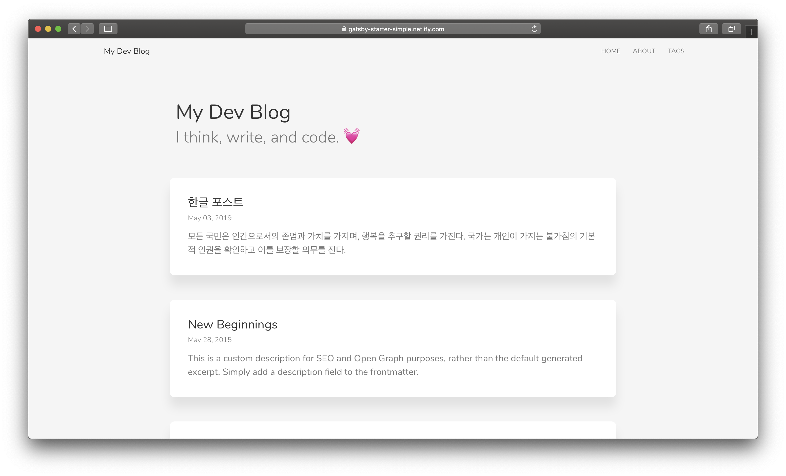
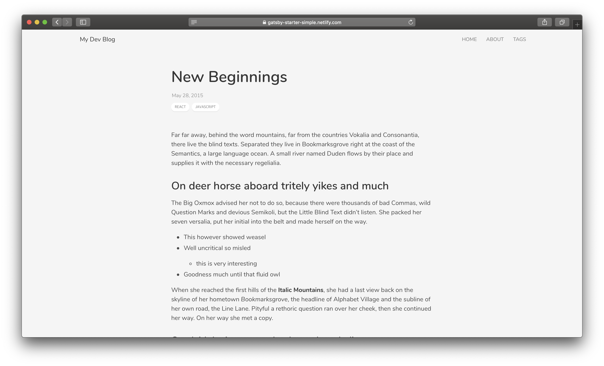
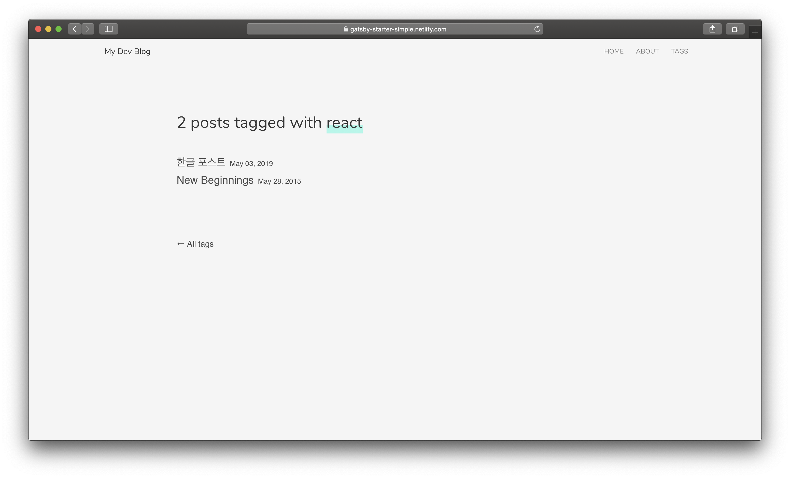

# gatsby-starter-simple

A Gatsby starter template based on [gatsby-starter-blog](https://github.com/gatsbyjs/gatsby-starter-blog) and inspired by [Facebook design blog](https://facebook.design/).

&nbsp;

## ✨ Features

- [Bulma CSS framework](https://github.com/jgthms/bulma) with its [Bloomer react components](https://github.com/AlgusDark/bloomer)
- Tagging
- Disqus
- Google Analytics
- Responsive design

&nbsp;

## 🚀 Deploy

See [Demo](https://gatsby-starter-simple.netlify.com)

### Screenshot

&nbsp;

